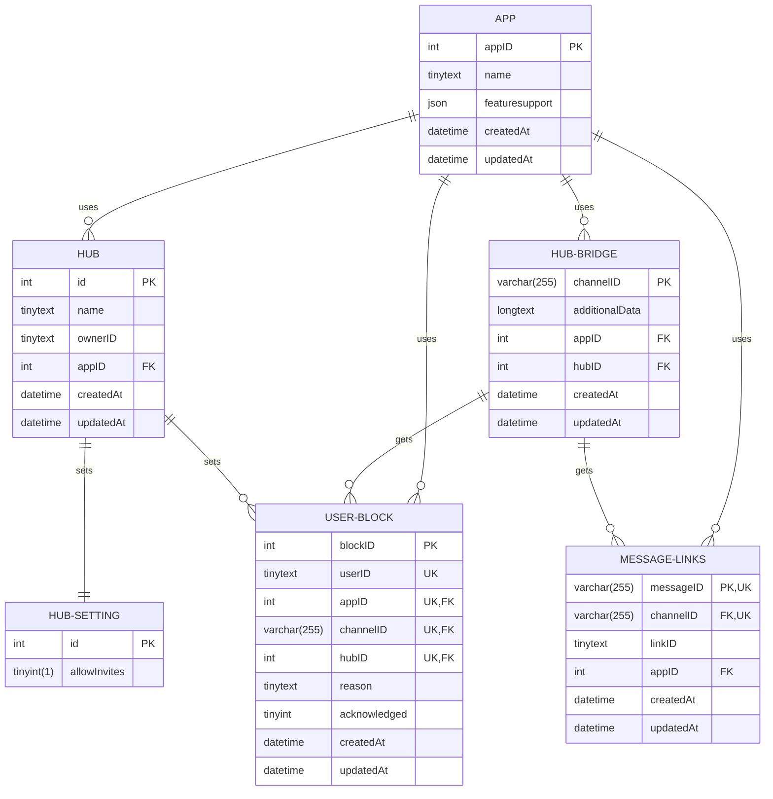

# Inter-Server Hub 2

This app is far from being done. The concept is to make a modular ecosystem in a monorepo to dynamic add or remove difference instant messaging services with the goal to connect channels or groups together.

## Development Notes

### Todo

The current status is to get Discord running again on this new infrastructure with the existing features from [I-SH v1](https://github.com/FlippedCodes/I-SH)

| Task | Status | Note |
|--|--|--|
| Documentation and Legal | 🚧 |  |
| Docker Setup | 🚧 |  |
| API | 🚧 |  |
| Discord | 🚧 |  |
| Telegram | ⏰ |  |
| Guilded | ⏰ |  |

<!-- # Standardizing all apps

## Features a platform should support

- Cache to save on DB calls (Maybe use a Redis DB?)

## Standard RabbitMQ Message that needs to be handled by every Platform

- h -->

### API Docs

#### Register App

Every app that uses the DB needs to regsiter so other apps know what features it supports and identify the Database entries belonging to that service.

### Database

