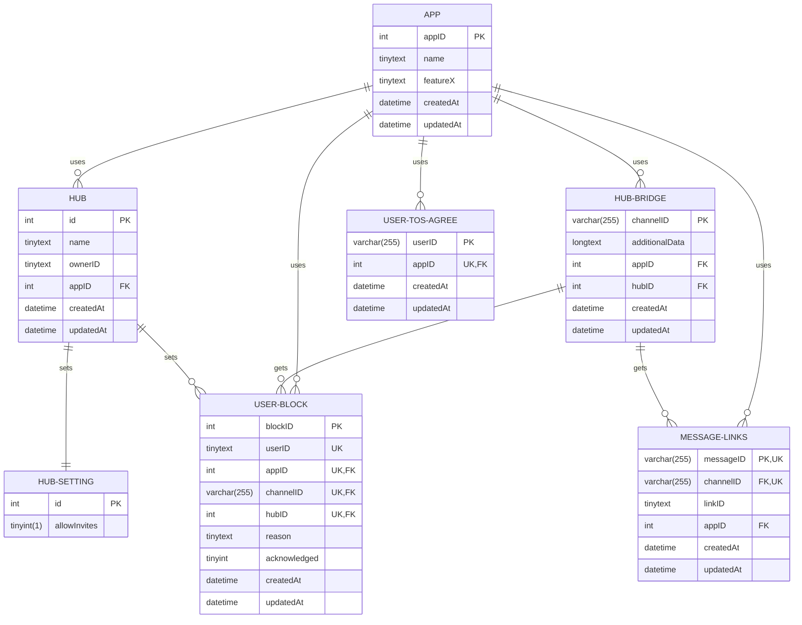

# Inter-Server Hub 2

The concept is to make a modular ecosystem in a monorepo to dynamic add or remove difference instant messaging services with the goal to connect channels or groups together.

> [!IMPORTANT]
> This is a very WIP project. I (Phil) will focus first of implementing all existing features from I-SH1 Discord-Only implementation.

## Table on Contents

- [Inter-Server Hub 2](#inter-server-hub-2)
  - [Table on Contents](#table-on-contents)
  - [Development Notes](#development-notes)
    - [Todo](#todo)
    - [Minimum features a platform should support](#minimum-features-a-platform-should-support)
    - [REST API Docs](#rest-api-docs)
      - [Endpoints and Versioning](#endpoints-and-versioning)
      - [`/v1`](#v1)
        - [API Token](#api-token)
        - [Identifier](#identifier)
        - [`/apps` - Services](#apps---services)
          - [Supported Features](#supported-features)
          - [GET](#get)
          - [POST](#post)
        - [`/apps/:identifier` - Individual Service](#appsidentifier---individual-service)
          - [GET](#get-1)
          - [DELETE](#delete)
        - [`/hubs` - Search Hubs](#hubs---search-hubs)
          - [GET](#get-2)
          - [POST](#post-1)
        - [`/hubs/:hubId` - Hub](#hubshubid---hub)
          - [GET](#get-3)
          - [PUT](#put)
    - [Database](#database)
      - [App feature list](#app-feature-list)
      - [Diagram](#diagram)

## Development Notes

### Todo

The current status is to get Discord running again on this new infrastructure with the existing features from [I-SH v1](https://github.com/FlippedCodes/I-SH)

| Task          | Status | Note                                                                                       |
| ------------- | :----: | ------------------------------------------------------------------------------------------ |
| Documentation |   🚧    | API Docs                                                                                   |
| Legal         |   🚧    | Includes proper notice to the user that messages sent need to obey the other platforms ToS |
| Docker Setup  |   ✅    |                                                                                            |
| API           |   🚧    |                                                                                            |
| Discord       |   🚧    |                                                                                            |
| Telegram      |   ⏰    |                                                                                            |
| Spacebar      |   ❔    |                                                                                            |
| Guilded       |   ❔    |                                                                                            |
| Signal        |   ❔    |                                                                                            |
| WhatsApp      |   ❌    | No bot support, unless provided by WhatsApp.                                               |

### Minimum features a platform should support

Before creating a bot for your favorite chat platform, make sure to suggest it first and it supports **all** the following features.

- Official Bot Support
- Send and view messages
- Get username and profile picture

### REST API Docs

#### Endpoints and Versioning

The endpoint will be reachable on `http://CONTAINERNAME:3000`. The API will try to get the hostname and post it into the logs.

It might be a little overkill, but it might be for the better with multiple services getting developed independently. So dynamic upgrades should be easier.

#### `/v1`

##### API Token

The API token is the same for all apps and just exists as a security measure. It needs to be send with every request in the `Authorization` header.

##### Identifier

A unique identifier name will be used, like `discord`, `signal` or `telegram` and is needed to be passed along with each API request. This helps services and RabbitMQ to identify each other.

##### `/apps` - Services

Every app that uses the DB needs to register so other apps know what features it supports and identify the Database entries belonging to that service.

###### Supported Features

As not all chat platforms are not created equally or are not done yet each app has to report what features they support. This will be also communicated to the user. For example no sticker support. A list of all the features currently possible, can be found in the [app feature list](#app-feature-list)

###### GET

Get list of all registered apps.

###### POST

Register or update app.

Validation:
- `name`
  - Lowercase
  - Only letters and numbers
- `features`
  - Not all features need to be named. Defaults can be found [here](#app-feature-list)

Body:

```json
{
  "name": "APPNAME",
  "features": {
    "featureX": true,
    "featureY": 0
  }
}
```

Response:

```json
{
  "id": 0,
  "name": "APPNAME",
  "features": {
    "featureX": true,
    "featureY": 0
  }
}
```

##### `/apps/:identifier` - Individual Service

###### GET

Get one app details and supported features.

Response:

```json
{
  [
    {
      "id": 0,
      "name": "APPNAME",
      "features": {
        "featureX": true,
        "featureY": 0
      }
    },
    ...
  ]
}
```

###### DELETE

Remove service when it is no longer being used. For this to work, the `delaunch` flag needs to be set to true.

> [!CAUTION]
> This removes ALL entries in the Database that where connected to the Service!

##### `/hubs` - Search Hubs

###### GET

Get a list of hubs a user owns.

Query parameters:

| Parameters   | Type   | Optional | Default value | Description                                              |
| ------------ | ------ | -------- | ------------- | -------------------------------------------------------- |
| `identifier` | string | ❌        |               | Identifier of the platform/app.                          |
| `ownerId`    | string | ❌        |               | The user id of the list of hubs that is being requested. |

Response:

```json
{
  [
    {
      "id": 0,
      "name": "HUBNAME",
    },
    ...
  ]
}
```

###### POST

Register or update app.

Validation:

- `name`
  - No spaces
  - Needs to be unique
- `ownerAppIdentifier`
  - App needs to exist

Body:

```json
{
  "name": "HUBNAME",
  "ownerID": "OWNERID",
  "ownerAppIdentifier": "identifier",
  "hubSettings": {
    "allowInvites": true
  }
}
```

Response:

```json
{
  "id": 0,
  "name": "HUBNAME",
  "ownerID": "OWNERID",
  "ownerAppIdentifier": "identifier",
  "hubSettings": {
    "allowInvites": true
  }
}
```

##### `/hubs/:hubId` - Hub

###### GET

Get hub details and settings

Response:

```json
{
  "id": 0,
  "name": "HUBNAME",
  "ownerID": "OWNERID",
  "ownerAppIdentifier": "identifier",
  "hubSettings": {
    "allowInvites": true
  }
}
```

###### PUT

Set hub details and settings of existing hub.

Validation:

- `name`
  - No spaces
  - Needs to be unique
- `ownerAppIdentifier`
  - App needs to exist

Body:

```json
{
  "name": "HUBNAME",
  "ownerID": "OWNERID",
  "ownerAppIdentifier": "identifier",
  "hubSettings": {
    "allowInvites": false
  }
}
```

Response:

```json
{
  "id": 0,
  "name": "HUBNAME",
  "ownerID": "OWNERID",
  "ownerAppIdentifier": "identifier",
  "hubSettings": {
    "allowInvites": false
  }
}
```

### Database

Before I get any comments on how cursed this DB looks: Sequelize (and TS) is not exactly meant to dynamically create tables and columns. On top of that IDs and structure is different on every app. I *could* use a NoSQL DB like MongoDB, tho I am already inexperienced in TS. Thats one of the reasons for the CRUD API to exist: We should be able to migrate to a different DB later on without major changes to all the bot-services.

#### App feature list

The list of features is hardcoded and needs to be extended, if new features get relevant.

| Name                | Type    | Optional | Default value | Description                                                                                                                           |
| ------------------- | ------- | -------- | ------------- | ------------------------------------------------------------------------------------------------------------------------------------- |
| `tos`               | string  | ❌        |               | Link to the terms of service that gets sent to the end user.                                                                          |
| `privacyPolicy`     | string  | ❌        |               | Link to the privacy policy that gets sent to the end user.                                                                            |
| `contentOffloading` | boolean | ❌        |               | The platform allows user content to be shared to other platforms without breaching the ToS for both services.                         |
| `textLength`        | int     | ❌        |               |                                                                                                                                       |
| `trackMessage`      | boolean | ✅        | `false`       | If the original or imposter message gets deleted, the bot can track that and send it to other platforms.                              |
| `deleteMessage`     | boolean | ✅        | `false`       | Platform allows message deletion **of other users**.                                                                                  |
| `deleteMessageTime` | int     | ✅        | `0`           | Some platforms only allow deletion of messages for a certain time, before being locked for bots to delete them. The value is in days. |
| `inviteLinks`       | boolean | ✅        | `false`       | It is possible to invite someone through a link. (Links under each embedded message.)                                                 |
| `webhookSupport`    | boolean | ✅        | `false`       | Allows embedding of username and profile picture to "impersonate" a user.                                                             |
| `media`             | boolean | ✅        | `false`       |                                                                                                                                       |
| `mediaStickers`     | boolean | ✅        | `false`       |                                                                                                                                       |
| `mediaEmojis`       | boolean | ✅        | `false`       |                                                                                                                                       |
| `delaunched`        | boolean | ✅        | `false`       | When a service gets delaunched from I-SH2. Can only be set to true, when the service doesn't have a queue open.                       |

#### Diagram


